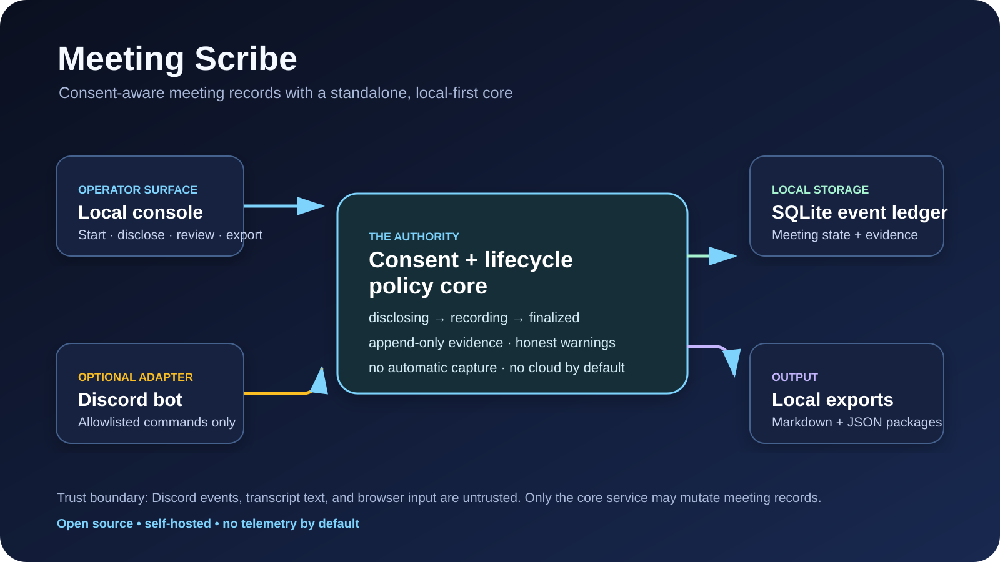
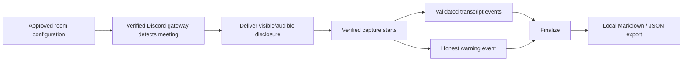
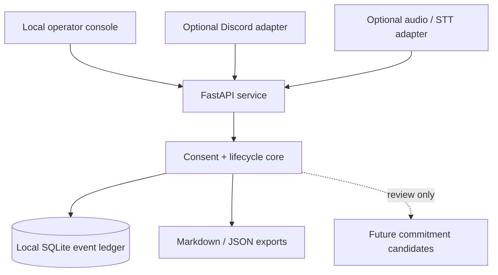

# Meeting Scribe

> **A self-hosted, consent-aware Discord meeting recorder—built around durable local records rather than a third-party SaaS.**

[](https://github.com/DropShock-Digital/meeting-scribe/actions/workflows/ci.yml)
[](LICENSE)
[](docs/PRIVACY.md)
[](docs/PRIVACY.md)

Meeting Scribe is a standalone, Docker-first application for meeting records you intentionally preserve. It has a private **control room** for observing an automatic Discord workflow, a durable SQLite event ledger, disclosure evidence, transcript ingestion, deterministic Markdown/JSON exports, and a separately configured Discord command adapter.

It is deliberately **not** an always-listening bot, a hosted meeting service, a legal consent product, or an automatic task/CRM/message automation system.



## Status

**Active early release.** The local lifecycle, console, export, tests, Docker setup, and public-release guardrails are working in the repository. The Discord command adapter is optional and disabled by default. Real Discord voice receive and speech-to-text are deliberately isolated adapter work: do not rely on a live meeting capture until you have completed the documented opt-in test-guild validation for your chosen audio/STT providers.

That boundary is intentional: a recorder must never pretend it captured or transcribed a meeting when an audio component is unavailable.

## What it does

| Capability | Included now | Safety posture |
|---|---:|---|
| Allowlisted meeting lifecycle API | Yes | Integration-level guardrail; normal operators do not enter identifiers in the control room |
| Disclosure + acknowledgement ledger | Yes | Every transition is stored as an append-only event |
| Local meeting lifecycle | Yes | `disclosing → recording/degraded → finalized` |
| Validated transcript segments | Yes | Accepted only during `recording`; never placed in app logs |
| Deterministic Markdown and JSON exports | Yes | Rebuilt from local event/state records |
| Private control room | Yes | Shows honest state; hides secrets and configuration IDs; supports non-capturing offline review records |
| Docker Compose reference setup | Yes | Binds to loopback by default; runs non-root with dropped capabilities |
| Discord slash-command bridge | Yes, optional | Disabled until explicitly configured; operator/channel allowlists apply |
| Real Discord audio receive / STT | Adapter boundary | Requires your own opt-in validation before production use |
| External task, CRM, email, calendar, or n8n writes | No | Out of scope by design |

## Quick start

### Local development

```bash
git clone https://github.com/DropShock-Digital/meeting-scribe.git
cd meeting-scribe
cp .env.example .env
uv sync --extra dev
uv run meeting-scribe serve
```

Open [http://127.0.0.1:8080](http://127.0.0.1:8080). The control room hides the default demo identity and lets you create an explicitly non-capturing offline review record; the allowlisted lifecycle API remains available for integration tests.

### Docker

```bash
cp .env.example .env
docker compose up --build
```

Open [http://127.0.0.1:8088](http://127.0.0.1:8088). The Compose reference binds to `127.0.0.1` only by default.

For a **Tailnet-only** review surface, set `MEETING_SCRIBE_HOST_BIND` to the host's currently verified Tailscale IPv4 address before starting Compose. Do not use `0.0.0.0`.

```bash
MEETING_SCRIBE_HOST_BIND=100.x.y.z docker compose -p meeting-scribe-review up --build -d
```

## The core flow



### Consent is a state transition, not a footer

1. Deployment configuration defines the approved rooms, operating identity, and disclosure. The normal control-room flow does not ask a person to re-enter those values.
2. A verified Discord gateway detects an approved meeting and creates a meeting in **`disclosing`** state. It does not accept transcript content yet.
3. The gateway delivers the visible/audible disclosure and records delivery evidence; only a verified capture worker may move the meeting to **`recording`**.
4. The application retains acknowledgement, warning, transcript, and finalization evidence in an append-only event ledger.
5. A finalized meeting is read-only and exportable. Offline review records remain non-capturing.

Meeting Scribe records operator evidence. It cannot determine whether recording is lawful or every attendee has validly consented. Read [Privacy and consent](docs/PRIVACY.md) before real use.

## Architecture

The core service owns policy, lifecycle state, SQLite persistence, and exports. Discord, audio receive, speech-to-text, AI enrichment, and workflow integrations are adapters—not dependencies of the core. The control room can keep a local room preference, but provider configuration stays out of the browser until an AI adapter passes its own verification gates.



- Full architecture and decisions: [`docs/bmad/architecture.md`](docs/bmad/architecture.md)
- Threat model: [`docs/bmad/threat-model.md`](docs/bmad/threat-model.md)
- Editable architecture diagram: [`docs/architecture/meeting-scribe-architecture.drawio`](docs/architecture/meeting-scribe-architecture.drawio)
- Operations and recovery: [`docs/OPERATIONS.md`](docs/OPERATIONS.md)

## Configuration

Copy `.env.example`. The core demo works without any token.

| Variable | Purpose |
|---|---|
| `MEETING_SCRIBE_DATA_DIR` | Local SQLite database and export directory |
| `MEETING_SCRIBE_CHANNEL_ALLOWLIST` | Comma-separated channel IDs/names permitted to create meetings |
| `MEETING_SCRIBE_OPERATOR_ALLOWLIST` | Comma-separated operator identities permitted to start/stop meetings |
| `MEETING_SCRIBE_MAX_TRANSCRIPT_CHARS` | Per-event request limit |
| `MEETING_SCRIBE_ROOM_CATALOG` | JSON catalog of `{key, channel_id, label}` entries; stable opaque keys and IDs remain server-side and rooms must be allowlisted |
| `MEETING_SCRIBE_CODEX_OAUTH_CONFIGURED` | Marks a separately provisioned, dedicated Codex OAuth connection configured; Meeting Scribe never reads Hermes auth state |
| `MEETING_SCRIBE_OPENROUTER_API_KEY_FILE` | Protected runtime key-file path; the browser receives only configuration status, never the path or key |
| `MEETING_SCRIBE_LMSTUDIO_CONFIGURED` | Marks an approved local LM Studio connection configured without exposing its endpoint |
| `MEETING_SCRIBE_COMPATIBLE_PROVIDER_*` | Label/configuration status for one approved OpenAI-compatible provider |
| `MEETING_SCRIBE_DISCORD_ENABLED` | Enables the optional Discord adapter only when `true` |
| `MEETING_SCRIBE_DISCORD_TOKEN` | Protected runtime secret; never commit it |
| `MEETING_SCRIBE_DISCORD_GUILD_ID` | The one guild the optional adapter is configured for |

The API intentionally has **no endpoint that returns environment variables or tokens**.

## API at a glance

| Route | Purpose |
|---|---|
| `GET /api/health` | Non-sensitive readiness response |
| `GET /api/console` | Sanitized control-room read model: capability and record status without secrets or configured IDs |
| `POST /api/meetings/offline-review` | Create a generated, explicitly non-capturing local review record |
| `GET /api/meetings` | Recent local meeting records |
| `POST /api/meetings` | Create an explicitly confirmed, allowlisted meeting |
| `POST /api/meetings/{id}/disclosure-delivered` | Append durable disclosure-delivery evidence; it does **not** claim capture has started |
| `POST /api/meetings/{id}/acknowledgements` | Store acknowledgement evidence |
| `POST /api/meetings/{id}/transcript` | Add a validated transcript segment during recording |
| `POST /api/meetings/{id}/warnings` | Record an honest degraded-state warning |
| `POST /api/meetings/{id}/finalize` | Finalize a meeting |
| `GET /api/meetings/{id}/export.md` | Deterministic Markdown export |
| `GET /api/meetings/{id}/export.json` | Deterministic JSON export |

Interactive API documentation is available locally at `/docs`.

## Discord setup—when you are ready

The Discord adapter is intentionally not a copy-paste production setup. Before enabling it:

1. Create a dedicated bot and keep its token in a protected runtime secret path.
2. Restrict the bot application, server permissions, operator identities, and voice/text channels to the least access needed.
3. Use a non-sensitive test guild and verify the exact disclosure, command permissions, reconnect behavior, transcript storage, failure warning, finalization, and export flows.
4. Start the command-only adapter explicitly—never as an implicit side effect:
   ```bash
   uv sync --extra discord
   meeting-scribe discord
   # or: docker compose --profile discord up -d
   ```
   It will refuse to start without `MEETING_SCRIBE_DISCORD_ENABLED=true`, a protected token, and a guild ID.
5. Complete your own legal/privacy/retention review.
6. Only then consider a real meeting.

Never put a bot token, recordings, transcript bodies, real Discord IDs, or private server URLs in issues, examples, screenshots, or logs.

## Security and privacy

- No telemetry or hosted AI call is enabled by default.
- No automatic recording is implemented.
- The reference deployment is **localhost-first**, not a public control plane.
- Transcript bodies are stored only in the local database/event export path and are not logged by the app.
- Docker runs as an unprivileged user, binds loopback by default, and drops Linux capabilities.
- `scripts/repo_safety_check.py` blocks common credential and private-deployment leakage patterns in source control.

Read [`SECURITY.md`](SECURITY.md) and [`docs/PRIVACY.md`](docs/PRIVACY.md) before deployment.

## Development and quality gates

```bash
uv sync --extra dev
uv run pytest
uv run ruff check .
uv run mypy src
python scripts/repo_safety_check.py
docker compose config
```

The CI workflow runs these same checks on pushes and pull requests.

## Project map

```text
src/meeting_scribe/     Core lifecycle, SQLite store, HTTP API, optional adapters, static console
tests/                  Policy, lifecycle, export, and console contract tests
docs/bmad/              Product brief, PRD, UX, architecture, threat model, test/release records
docs/architecture/      Editable draw.io source and public SVG preview
scripts/                Local smoke and public-repository safety checks
.github/                CI and safe issue intake
```

## Roadmap

- [ ] Complete test-guild validation for an isolated Discord voice receive adapter.
- [ ] Add a provider-neutral, local-first speech-to-text worker with bounded resource admission.
- [ ] Add encrypted backup/export guidance and a restore rehearsal tool.
- [ ] Add authenticated multi-user operator mode only with a dedicated public/private deployment review.
- [ ] Add review-only commitment candidates with evidence locators—never automatic external writes.

## Contributing

Please read [`CONTRIBUTING.md`](CONTRIBUTING.md). The most valuable contributions preserve the core guarantees: explicit consent, honest failure modes, local ownership, no secret leakage, and small replaceable adapters.

## License

MIT © 2026 DropShock Digital. See [`LICENSE`](LICENSE).
